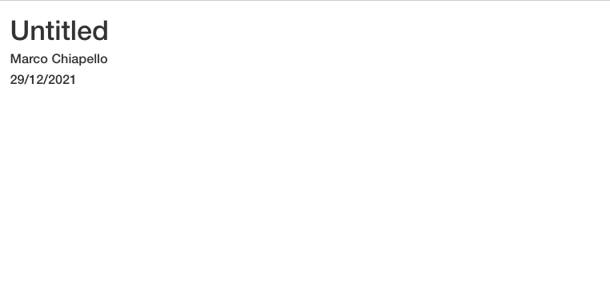
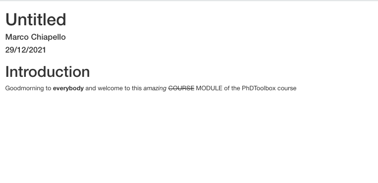
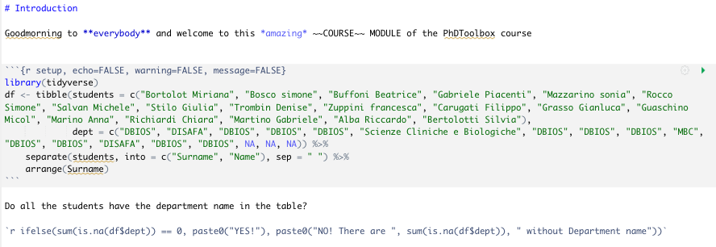
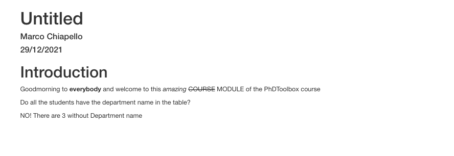

```{r setup, include=FALSE, cache=FALSE}
# TO render: rmarkdown::render('git.Rmd', 'xaringan::moon_reader')
# set working directory to docs folder
#setwd(here::here("docs"))

# Set global R options
options(htmltools.dir.version = FALSE, servr.daemon = TRUE)

# Set global knitr chunk options
knitr::opts_chunk$set(
  fig.align = "center", 
  cache = TRUE,
  error = FALSE,
  message = FALSE, 
  warning = FALSE, 
  collapse = TRUE 
)

library(xaringanExtra)
use_tile_view() 
use_panelset()
library(xaringanthemer)
style_duo_accent(
  primary_color = "#1381B0",
  secondary_color = "#FF961C",
  inverse_header_color = "#FFFFFF",
  padding = "1px 64px 16px 64px",
  base_font_size = "30px",
  header_font_google = google_font("Josefin Slab", "600"),
  text_font_google = google_font("Roboto", "300"),
  text_slide_number_font_size = "0px",
  extra_fonts = list(
    google_font("Sofia"),
    # Young Serif by uplaod.fr
    "https://cdn.jsdelivr.net/gh/uplaod/YoungSerif/fonts/webfonts/fontface.css"
  ),
  extra_css = list(
    ".marco" = list("font-family" = "Sofia"),
    ".fl img" = list(float = "right"),
    ".fl p" = list(float = "right"),
    ".content-box" = list(
        "border-radius" = "15px",
        "overflow" = "hidden",
        "display" = "block",
        "text-align" = "center",
        "padding" = "2px",
	      "background-color" = "#FF961C",
        "margin" = "15px"),
    ".f60" = list("font-size" = "60px"),
    ".f20" = list("font-size" = "20px"),
    ".f40" = list("font-size" = "40px"),
    ".f200" = list("font-size" = "200px"), 
    ".center" = list(
      margin = "auto",
      width = "50%",
      padding = "10px"),
    ".list1 p, .list1 ul li, .list1 ol li" = list(
      "line-height" = "27px",
      "font-size" = "25px",
      "margin" = "10px"),
    ".list2 p, .list1 ul li, .list1 ol li" = list(
      "line-height" = "23px",
      "font-size" = "20px",
      "margin" = "0px"),
    ".m5h4 h4" = list("margin" = "5px"),
    ".m5p p" = list("margin" = "5px")
  )
)
```

class: title-slide   


<br><br><br>
# .font200[`r rmarkdown::metadata$subtitle`]
## .font180[`r rmarkdown::metadata$title`]

<br>
.marco[
Marco Chiapello
<br>
January, 14th 2022
]

---

layout: true

# Markdown

---

## What is markdown? 

- Markdown is a lightweight markup language for creating formatted text using a plain-text editor

- You can use special characters to define text styles    
  - `#` is used for header definition    
  - `**` around a word makes it **bold**

- Refer to this [link](https://www.markdownguide.org/cheat-sheet/) for more detailed information

- See the Markdown language in action: [click here](https://markdown-it.github.io/)

---

layout: true

# Rmarkdown

---

```{r echo = FALSE, out.height="630px"}
knitr::include_graphics("images/rmarkdown_wizards.png")
```

---

## What can do Rmarkdown? 

- R Markdown documents are fully reproducible

- Weave together narrative **text** and **code** to produce **elegantly formatted output**

- R Markdown supports dozens of **static and dynamic output formats** including HTML, PDF, MS Word, Beamer, HTML5 slides, Tufte-style handouts, books, dashboards, shiny applications, scientific articles, websites, and more. 


---

## Rmarkdown anatomy

There are 3 fundamental elements in a Rmarkdown document

1. Metadata

1. Text

1. R chunks

---

## Metadata

The YAML metadata of your document. This is the first part of the document and defines metadata like title and author, but also important iformation for the file output.

.panelset[
.panel[.panel-name[Code]

```
---
title: "Untitled"
author: "Marco Chiapello"
date: "29/12/2021"
output: html_document
---
```
]

.panel[.panel-name[Output]

```{r echo = FALSE, out.width="830px", out.height="430px"}


```
]
]

---

## Plain text

The text in a Rmarkdown document is a regular text using the markdown sysntax

.panelset[
.panel[.panel-name[Code]

```
---
title: "Untitled"
author: "Marco Chiapello"
date: "29/12/2021"
output: html_document
---

# Introduction

Goodmorning to **everybody** and welcome to this *amazing* ~~COURSE~~ MODULE of the PhDToolbox course

```

]

.panel[.panel-name[Output]

```{r echo = FALSE, out.width="830px", out.height="430px"}


```
]
]

---

## R chunk

The R chunk is the place where we can write down R code and make it interact with the document.

.panelset[
.panel[.panel-name[Code]

```{r echo = FALSE, out.width="830px", out.height="300px"}

```

]

.panel[.panel-name[Output]

```{r echo = FALSE, out.width="830px", out.height="330px"}

```

]
]

---
layout: false
class: inverse, middle, center

.white[
.font700[DEMO]
]
